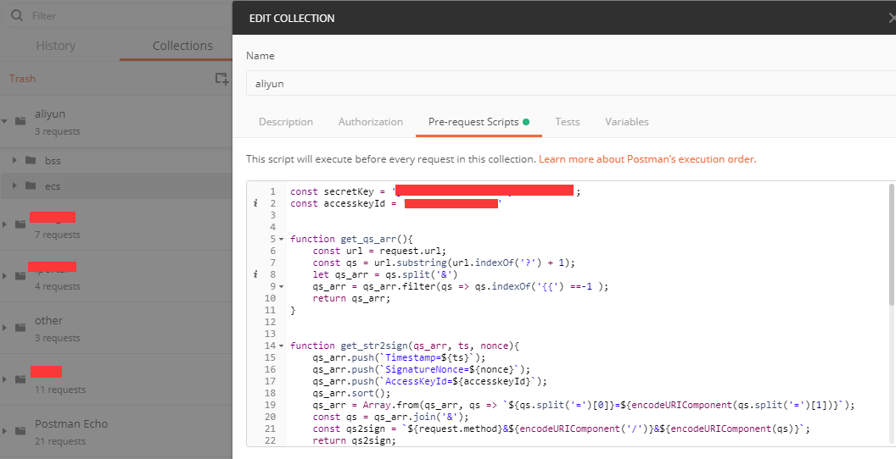

# 阿里云开放 API Python 和 Postman 的实现


## Python(aliyun.py)
需安装 requests 包依赖，兼容 Python2/3。
这里仅提供了查询实例和查询账单两个 API 的实现，其他的请参照官方文档。

### [DescribeInstances](https://help.aliyun.com/document_detail/25506.html)
```
request:
    Action  DescribeInstances
    Format  JSON
    AccessKeyId **********
    SignatureMethod HMAC-SHA1
    Timestamp   2019-04-13T15:05:10Z
    SignatureVersion    1.0
    SignatureNonce  0.24401062402284268
    RegionId    cn-zhangjiakou
    Version 2014-05-26
    PageNumber  1
    PageSize    20
    Signature   ************

response:
{
    "PageNumber": 1,
    "TotalCount": 152,
    "PageSize": 20,
    "RequestId": "112BAACB-D99E-4713",
    "Instances": {
        "Instance": [{
            "ImageId": "centos_7_06_64",
            "VlanId": "",
            "EipAddress": {
                "IpAddress": "",
                "AllocationId": "",
                "InternetChargeType": ""
            },
        }, ...]
    }
}
```
### [QueryInstanceBill](https://help.aliyun.com/document_detail/100400.html)
```
request:
    Action  QueryInstanceBill
    Format  JSON
    AccessKeyId ********
    SignatureMethod HMAC-SHA1
    Timestamp   2019-04-13T15:05:53Z
    SignatureVersion    1.0
    SignatureNonce  0.9237961174062019
    BillingCycle    2019-03
    ProductCode ecs
    Version 2017-12-14
    PageNum 1
    PageSize    20
    Signature   bpHxNDLg********

response:
{
    "Data": {
        "Items": {
            "Item": [{
                "SubscriptionType": "PayAsYouGo",
                "InstanceID": "*********",
                "ProductCode": "ecs",
                "ProductDetail": "云服务器ECS-按量付费",
                "CostUnit": "未分配",
                "PretaxAmount": ****,
                "PaymentAmount": ****,
                "OutstandingAmount": 0.0,
                "DeductedByCashCoupons": 0.0,
                "ProductName": "云服务器 ECS",
                "BillingType": "其它",
                "Currency": "CNY",
                "PretaxGrossAmount": *****,
                "InvoiceDiscount": 
            }, ...]
        },
        "TotalCount": **,
        "BillingCycle": "2019-03",
        "AccountID": "******",
        "PageSize": 20,
        "AccountName": "********",
        "PageNum": 1
    },
    "Message": "Successful!",
    "RequestId": "C6446*****",
    "Success": true,
    "Code": "Success"
}
```


## Postman
### pre_request_script.js
js 的签名算法。
在 postman 新建 collection，然后将 `pre_request_script.js` 的内容 copy 到 collection 的 `Pre-request Script`里，之后就可以在请求中使用 `AccessKeyId Timestamp SignatureNonce Signature` 这几个环境变量了。


### aliyun.postman_collection.json
可使用 postman 直接导入，然后填入`Pre-request Script`中的`secretKey accesskeyId`即可。